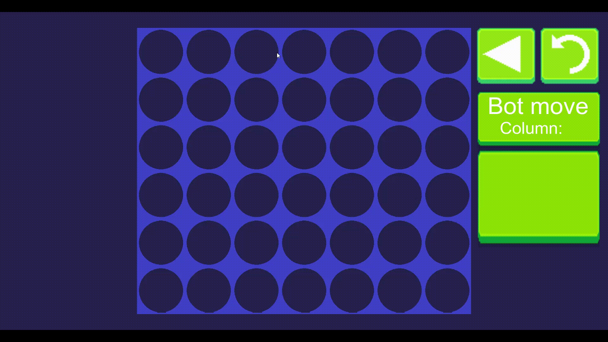
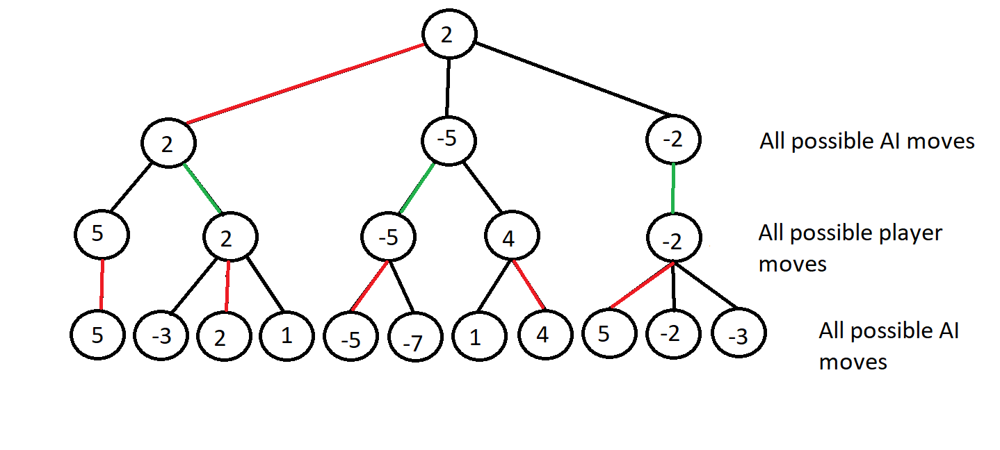
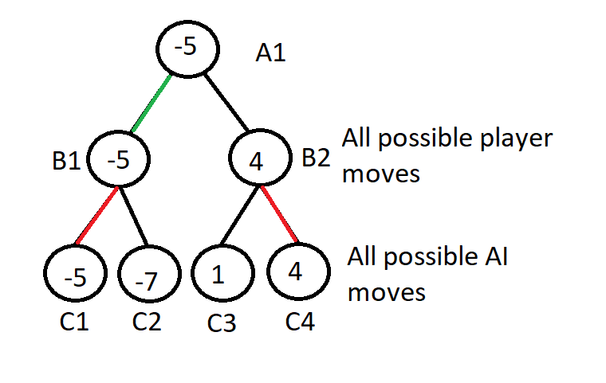

# Four-in-a-row-AI

## About the game

This game is a version of the popular game Connect Four (or Four in a Row). The game consists of a 6 bricks high and 8 bricks wide board. The two players take turns putting a brick (green brick for player 1 and red brick for player 2) in the lowest available spot in any column. The game ends when a player has four consecutive bricks in a horisontal, vertical or diagonal row.

In this game you will play against the computer in a difficulty of your choosing. Will you take on the challenge to win against the computer on Hard?

## About the project

The purpose with this project was to learn how to implement the minimax algorithm in a real game. If you want to see another example using the same algorithm, I have also developed a [chess game](https://github.com/Robert-Mellberg/Chess-AI). The project was developed using Unity for the scenes and Visual studio for writing the C# scripts. During the developement there were some minor problems i ran into that i had to solve.

Graphics stopped moving when the processor was busy computing the best move for the AI. I solved this problem by first fixing all the graphics (such as turning the turn indicator red etc.) and then starting the computation. This can also be solved by using paralell programming so that both actions can take place at the same time.

The other problem that I ran into was that it was hard to configure the AI the be at an appropriate difficulty level. The easiest difficulty is too easy and the second easiest difficulty is too hard, the two hardest difficulties are barely different. Read the next section to see how the AI is implemented.

**Note** that the scripts do not have any documentations. If you want me to add documentations, send me an email.

### How the AI works

The basic idea of the AI is too look at all outcomes a few steps ahead and then choose the move that will lead to the best outcome.

The first thing the AI needs is a function to determine how good a board state is for the computer. The function will calculate an integer value where a higher value means that the board is more preferable for the AI.
* If the AI has bricks in a row the value should be increased, if the player has bricks in a row it should be decreased.
* Four bricks in a row should increaes the value more than any amount of three bricks in a row. Three bricks in a row should increase the value more than any amount of two bricks in a row.
* Bricks in a row that are trapped on both sides should not increase the value unless there are four bricks in a row.

When you have your evaluate function you need to generate all possible outcomes. First generate one board for each move that the AI can make, on every generated board generate one board for every move the player can make, on every such generated board generate one board for every move the AI can make...

The more generated boards the better the AI will be. The generated outcomes can be represented by a decision tree as in the figure below. On every board that is a leaf you should use the evaluate function to determine how preferable the board is. If the siblings were generated by the AI's moves, set parent node to the leaf node with the highest value, if the siblings were generated by the player's moves, set parent node to the leaf node with the lowest value. Repeat until the root node has a value. The move the AI should make is the one that generates the root-node's child with the highest value.

There are still ways to optimize the algorithm by skipping unnecessary computations. Consider the subtree of the same decision tree in the figure below. After C1 has been evaluated, there's no reason to continue to calculate the value of B2 since that path will never be taken. The reason for that is because C1 is bigger than B1, therefore B2 will be bigger than B1, A1 wants the lowest value and will therefore never choose B2's value. The general rule is that if the node X's children have values that is less preferable from X's parent's perspective than any of X's siblings, then you don't have to compute X.

## How to install the game

### Install on Windows

1. Go to the latest [release](https://github.com/Robert-Mellberg/Four-in-a-row-AI/releases/tag/v1.0)
2. Download the compressed folder FourInARow.zip under "Assets"
3. Right click the folder and choose "Extract All"
4. Start the game by launching FourInARow.exe

### Install on android

1. Go to the latest [release](https://github.com/Robert-Mellberg/Four-in-a-row-AI/releases/tag/v1.0) with the android application
2. Download the APK file called FourInARow.apk
3. Press open file when prompted to do so
4. Press install
5. Start the game by launching the application

## How to install the Unity project

1. Download the [Unity package](https://github.com/Robert-Mellberg/Four-in-a-row-AI/blob/master/FourInARow.unitypackage)
2. Create a new project in Unity
3. Go to Assets -> Import Package -> Custom Package... and select the Unity package

## Contact information
Robert Mellberg

robmel@kth.se
